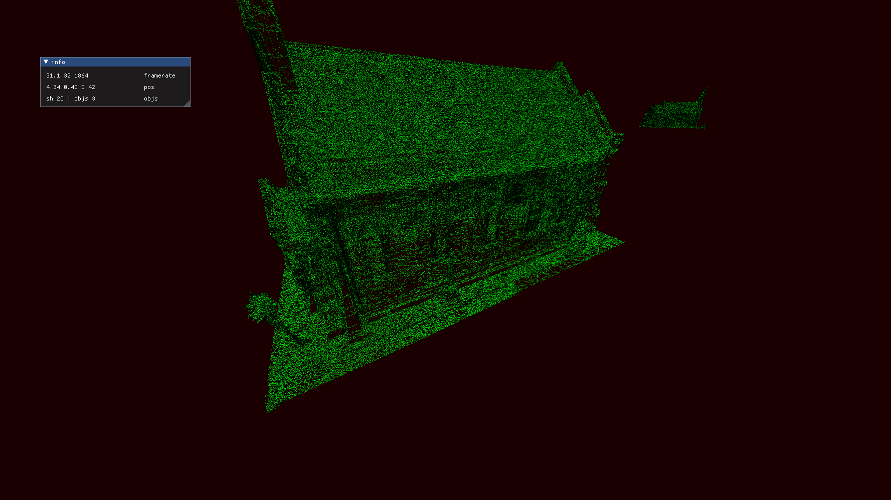

# rust-gl

This is my experimental rendering library that I've used for a couple of my projects and experiments, including my rust implementation of the eades spring embedder [gabehowe/gl-spring-embedder](https://github.com/gabehowe/gl-spring-embedder). 

The examples are, in order of most to least interesting:

A simple 3d rendering test with GLTF and OBJ model loading.
```bash
cargo run --example chapel
```

The drawing module drawing very many dots.
```bash
cargo run --example drawing_test
```

Empty space.
```bash
cargo run --example untextured_cube
```


Works with modified dependencies:
- https://github.com/gabehowe/rust-imgui-opengl-renderer
- https://github.com/gabehowe/imgui-glfw-rs
 



